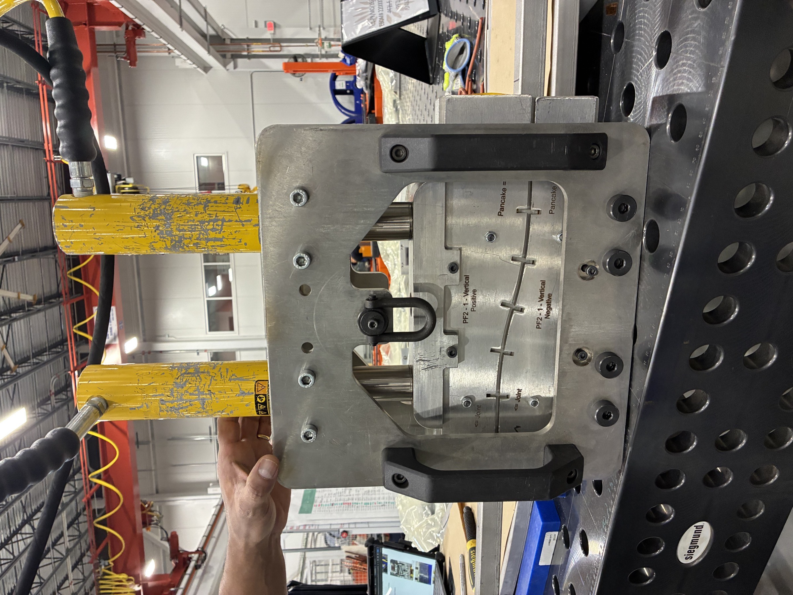
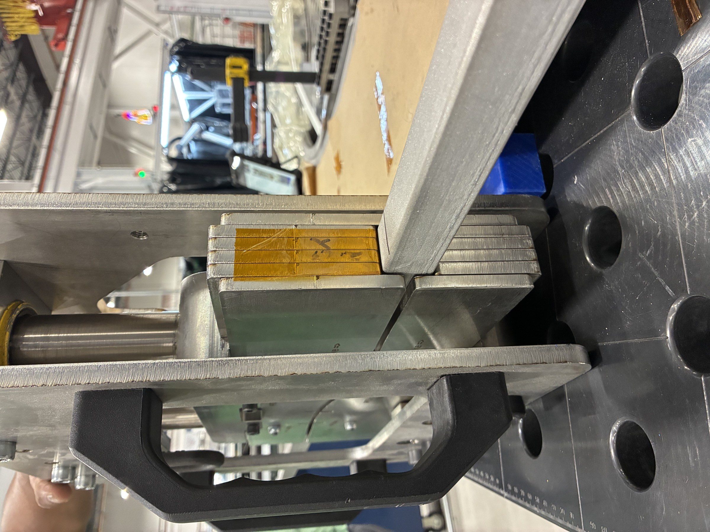
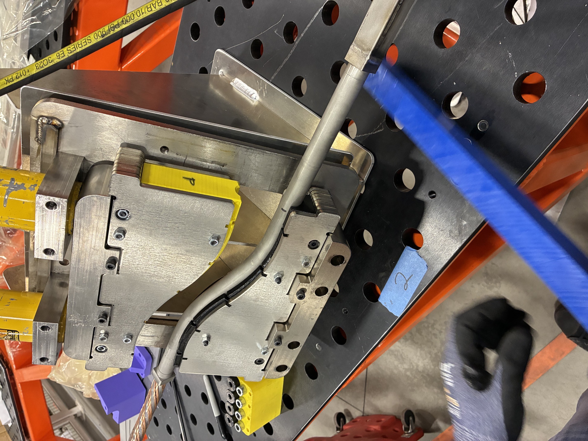

## Problem

The previous bending equipment produced bends shorter than required, formed only one bend at a time, required multiple adjustments, wasted full shifts, and relied on operators "eyeballing" the geometry to meet specs.

## What I did

* Derived a generalizable equation relating bend offset, radius, and arc length to compensate for spring-back, and redesigned the bending plates to create both bends at once.
* Reconfigured the bolting and piston layout, increasing shear capacity to **44 kips**.
* Added crane-assisted handling to eliminate manual lifting while maintaining ease of operation.

## Outcome

* Consistently bending to spec on the first press.
* Cut bending operation time from a full shift down to a quarter.
* Improved ergonomics, reduced injury risk, and increased first-pass accuracy.

## Gallery

