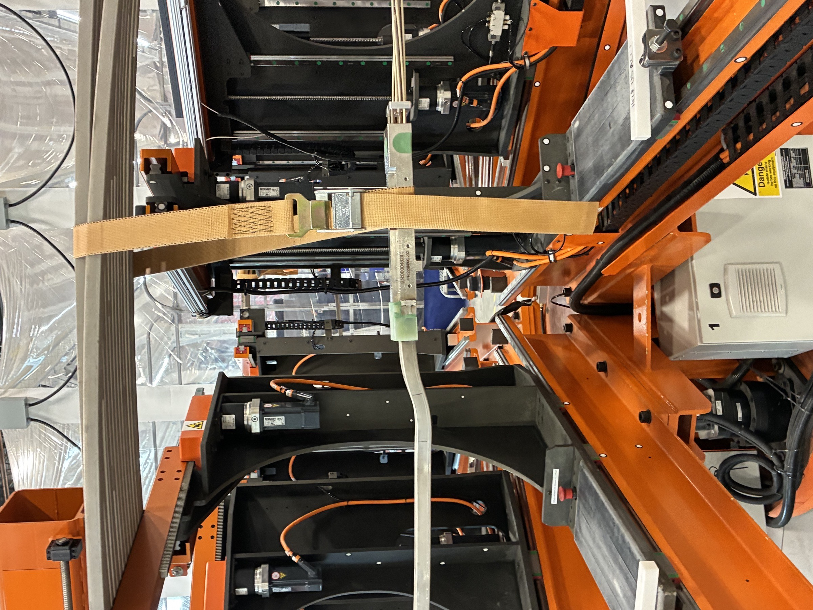
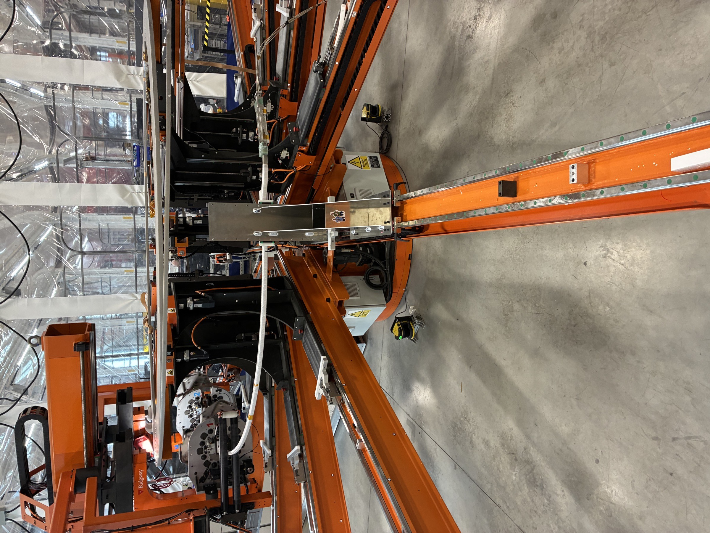
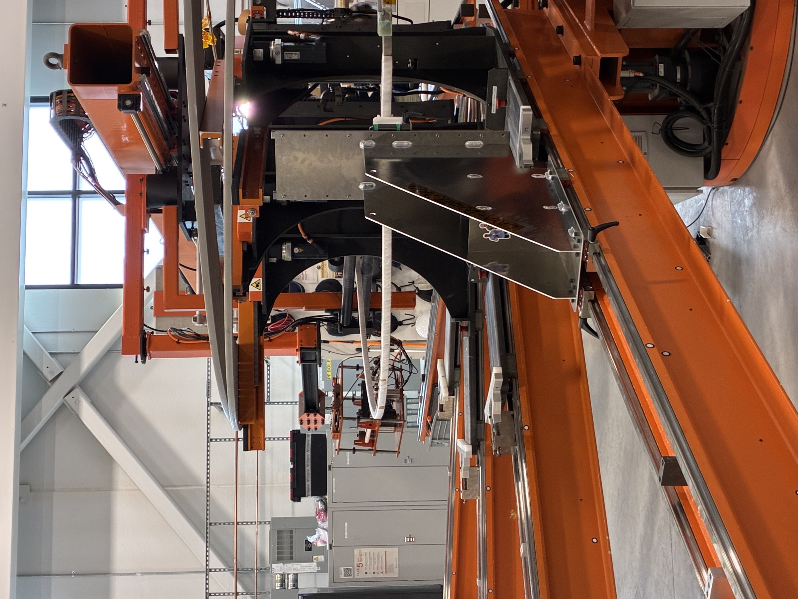
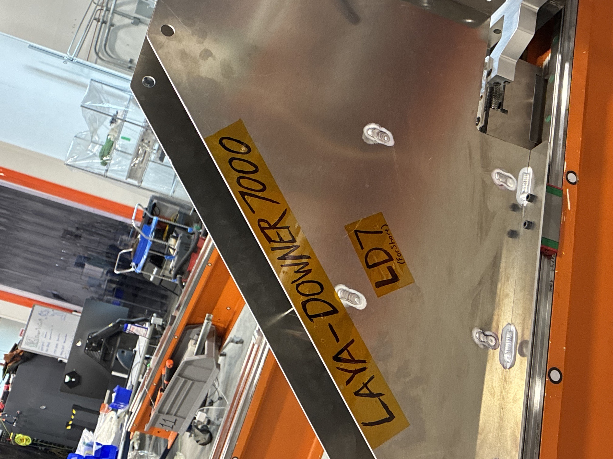

> **Placeholder content — replace with real text.** I dropped in plausible-sounding text and the photos so you can see how the page lays out. Edit this file at `src/content/projects/layerdowner.md`.

## Problem

During poloidal-field magnet winding, each turn of HTS conductor had to be placed by hand at the correct radial position with consistent tension. Manual layup was slow, hard on operators, and produced occasional bunching that required unwinding and re-laying — a costly recovery operation given the conductor cost and assembly clock.

## What I did

- Designed a powered layup head that travels along the magnet axis on a precision rail, paying out conductor through a tension-controlled feeder.
- Integrated a closed-loop tension control system with low-friction guide rollers; tuned for the HTS conductor's bend-radius and surface-finish constraints.
- Built an operator HMI that shows real-time tension, layup position, and turn count, with a one-button pause/resume so operators can clear conductor splices safely.
- Ran a process FMEA against the existing winding procedure; updated SOPs and trained the operator team.

## Outcome

- Layup speed roughly **3× faster** than the manual baseline.
- Inter-turn spacing variation dropped to **≤ 0.2 mm** across full winds.
- Bunching/unwind events on the documented production runs went to zero in the first month of operation.

## Gallery

