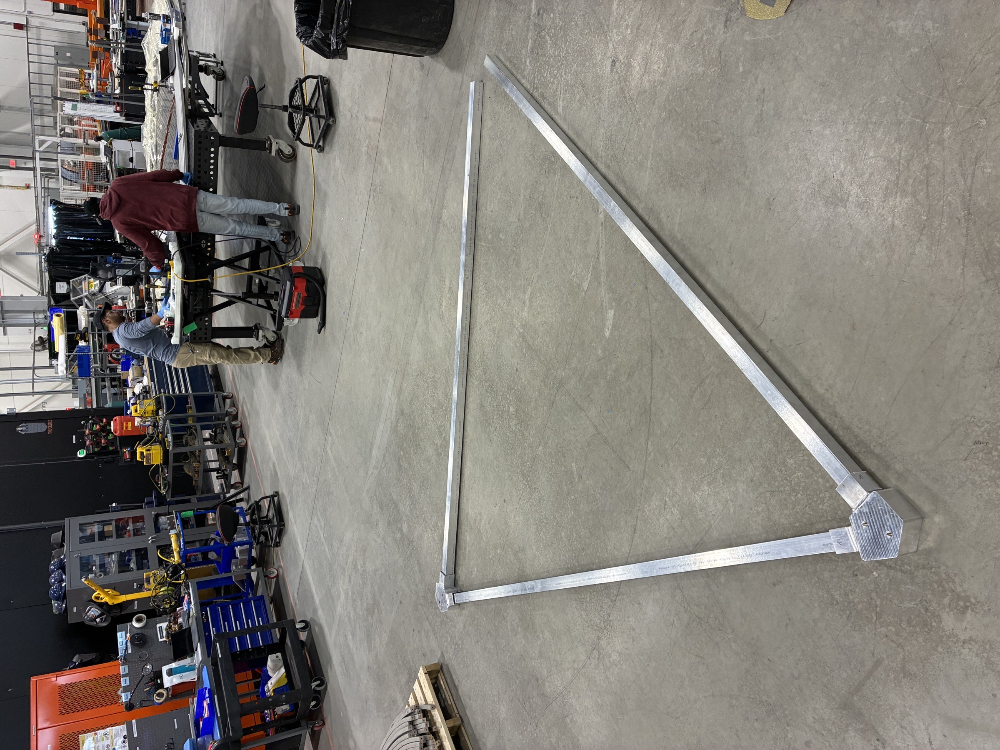
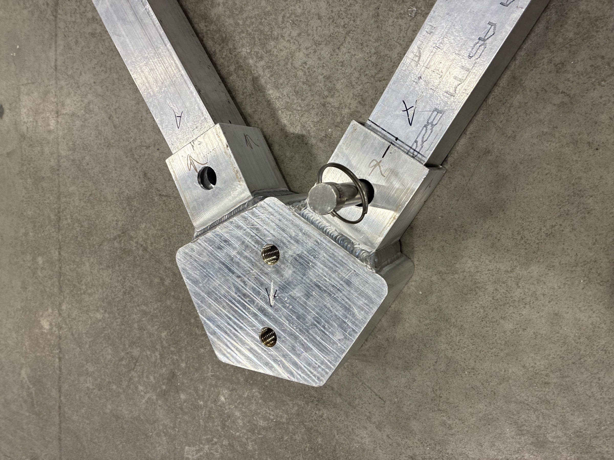
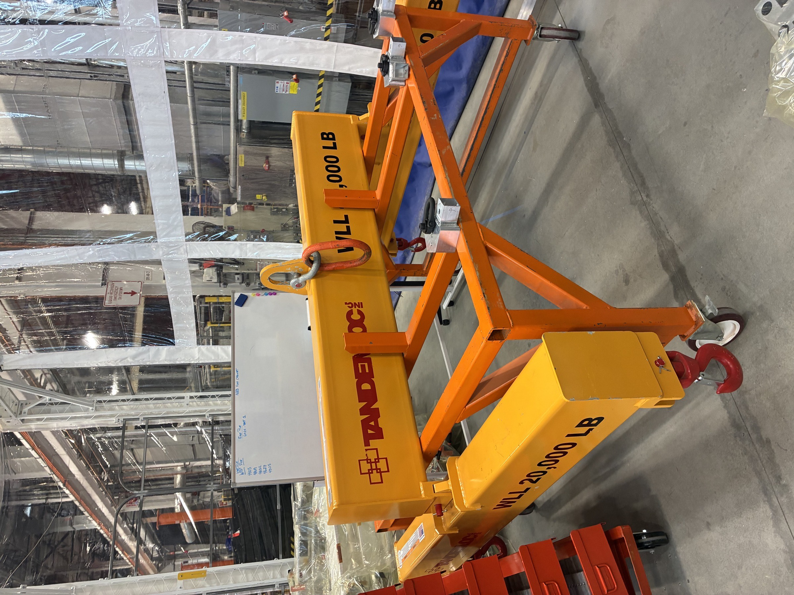
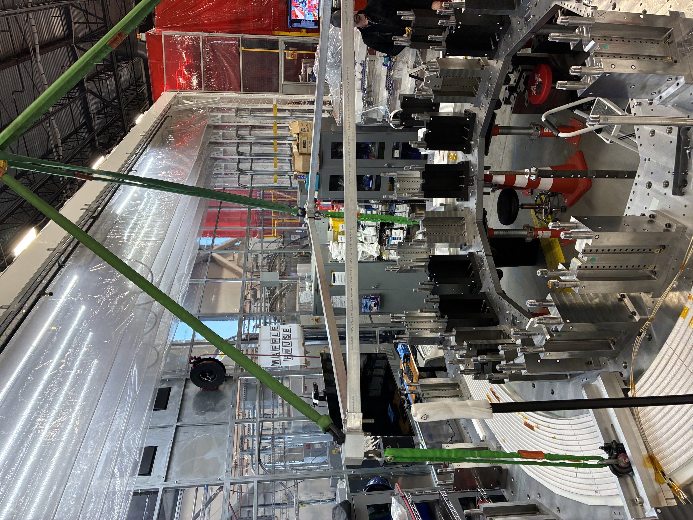
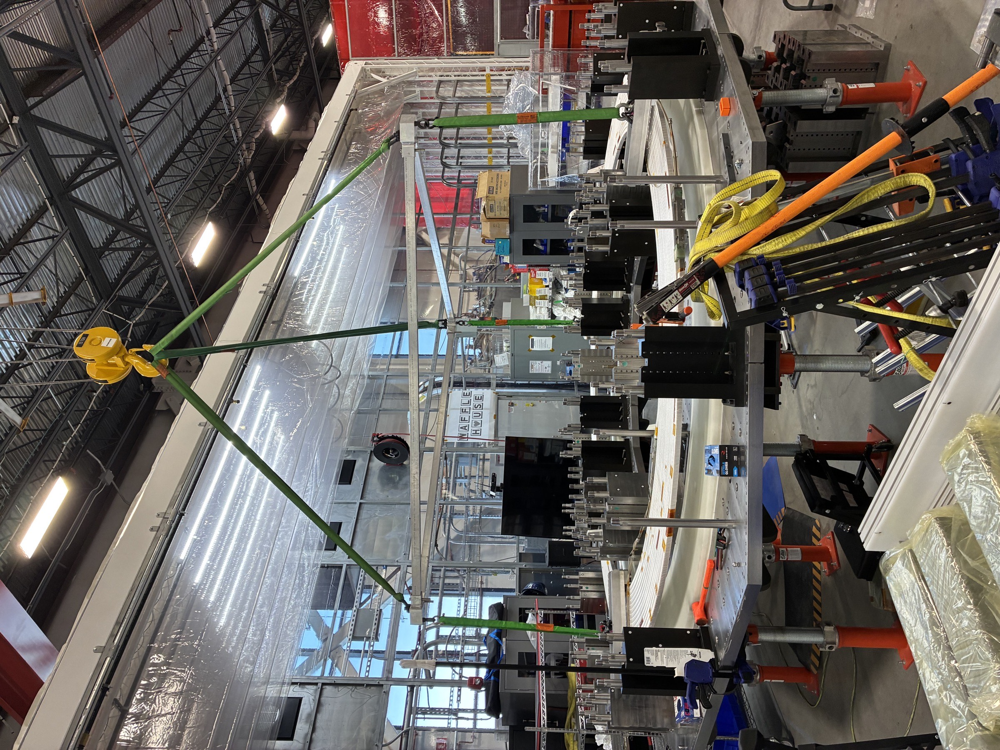
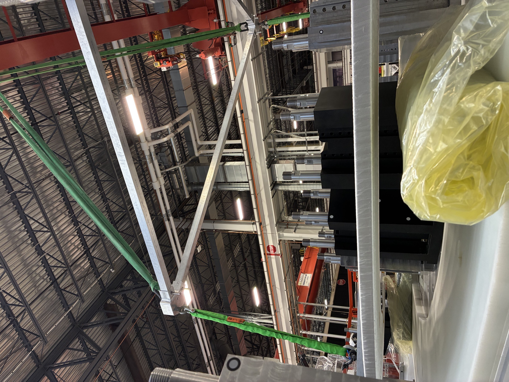
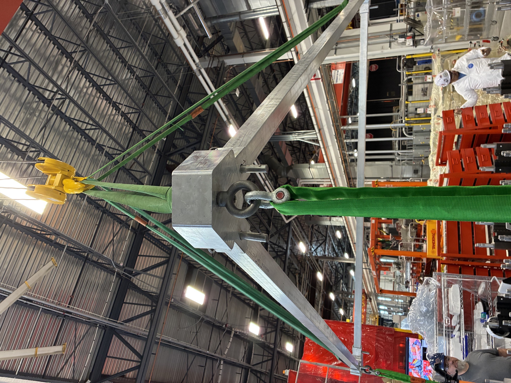
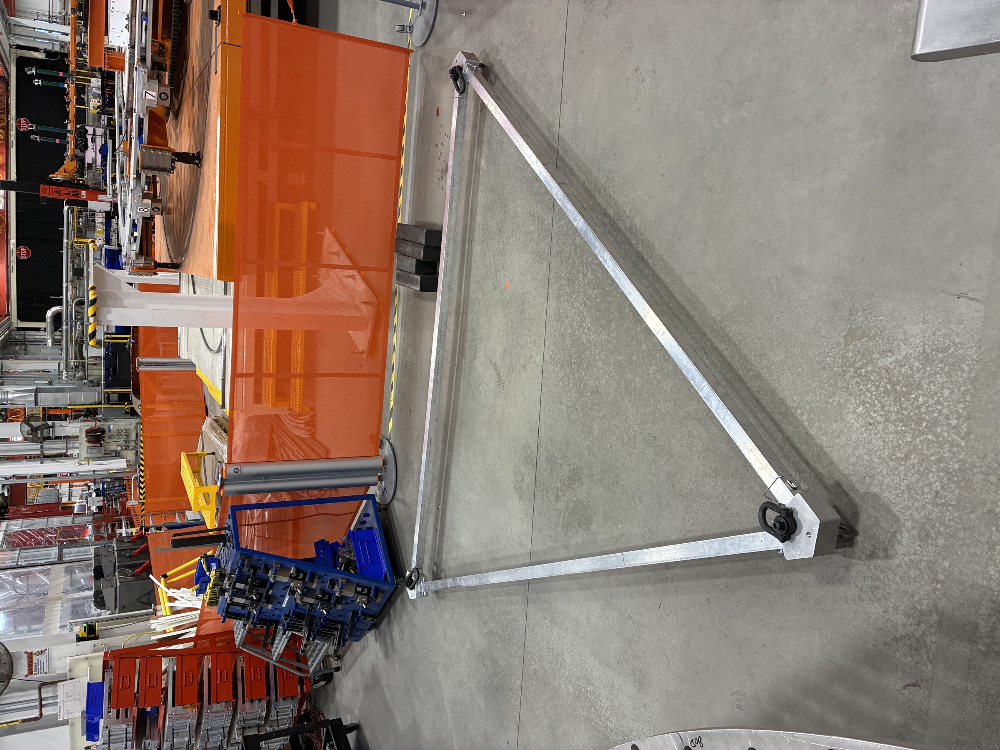

> **Placeholder content — replace with real text.** I dropped in plausible-sounding text and the photos so you can see how the page lays out. Edit this file at `src/content/projects/lifting-frame.md`.

## Problem

The poloidal-field magnet sub-assemblies needed to move from the assembly fixture to test stations, but the existing rigging used a generic spreader bar that produced asymmetric loading on the lift points. The mismatch between the assembly's center of gravity and the bar's geometry forced operators to manually balance the load with come-alongs — a slow and ergonomically poor process.

## What I did

- Modeled the assembly's mass distribution and computed CG offset across all expected configurations.
- Designed a 3-point lifting frame whose attach points line up with the assembly's lift lugs, keeping the load level without manual rebalancing.
- Ran linear static FEA on the welded frame at **2× rated load** plus the ASME BTH-1 design-category-B safety factor; iterated the gusset and pad-eye geometry until the worst-case Von Mises stress was below 1/3 yield.
- Specified weld procedures and inspection requirements for the fabricator; reviewed the weld map at hand-off.
- Worked with riggers on initial proof-load testing and walked through the lift plan with the safety team.

## Outcome

- Frame proof-tested to **125% of rated load** with no measurable deformation.
- Lift cycle time dropped from ~30 min (with rebalancing) to under 10 min.
- Approved for routine production use; documented as a standard piece of MHE for the line.

## Gallery

