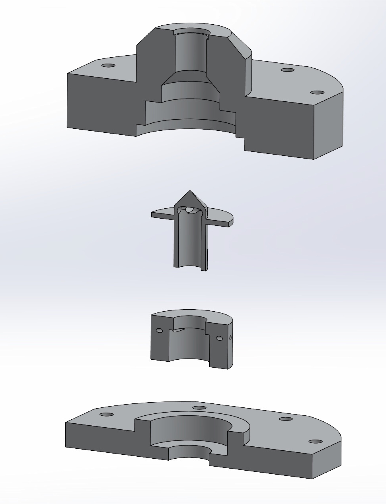
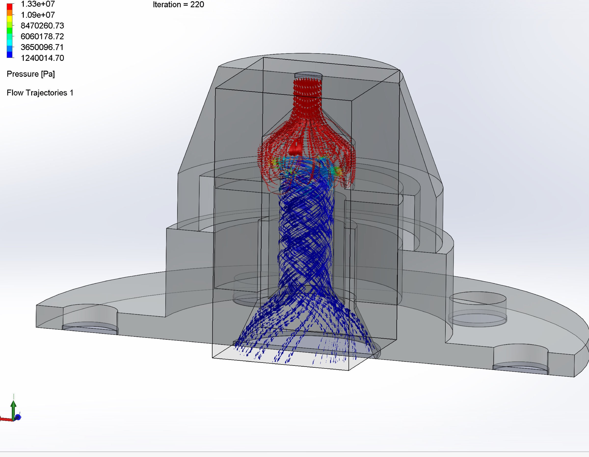

## Problem

Tasked with the initial design of a machinable swirl injector for mixing kerosene and gaseous oxygen well — a critical step in achieving optimal combustion for a student-built rocket engine.

## What I did

- Created the initial design parametrically, with global variables for orifice diameter, inlet lengths, and spray angle so we could iterate quickly.
- Collaborated with other team members to learn HSMWorks CAM, SolidWorks Flow Simulation, and the underlying fluid principles together.
- Sized the injector around the chamber and nozzle so the full assembly stacked up cleanly.

*Full stackup with chamber and nozzle.*

<video controls muted loop playsinline preload="metadata">
  <source src="/videos/swirl-injector-test.mp4" type="video/mp4" />
</video>
*Flow test — solving for required pressure.*

## Outcome

- Water flow testing showed the expected swirling effect, mixing, and conical spray pattern.
- Stacked up cleanly with the chamber and nozzle for downstream integration.

